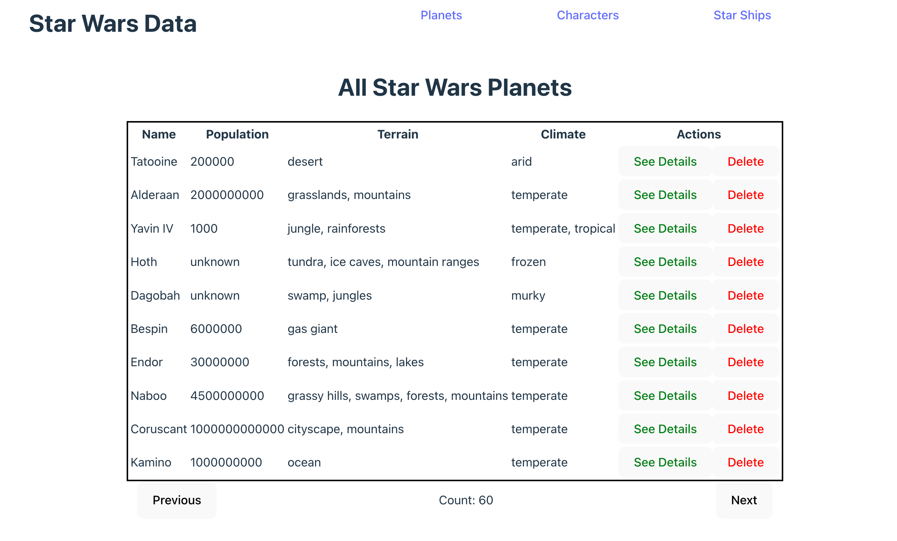

# Story 123: As a user, I want to be able to manage a list of planets.

Designs: 

Requirements: 
- See a table of all the planets (Ticket 124)
- See additional details (Tickets 126)
- delete a planet (Ticket 125)
- add new planet (Ticket 127)
- search for a planet (Ticket 128)
- edit a planet (Ticket 129)

## Ticket 124: As a user I want to be able to see a list of planets

Designs: 

Requirements
- should pull planet info from /planets
- only view 10 at a time
- see the name, population, climate, terrain and additional actions i can take

## Ticket 125: As a user I want to be able to delete a planet

requirement:
- Delete a planet from the list view
- should also hit the delete endpoint /planets/:id

## Ticket 126: As a user I want to be able to see additional details about a planet

designs: TBA

